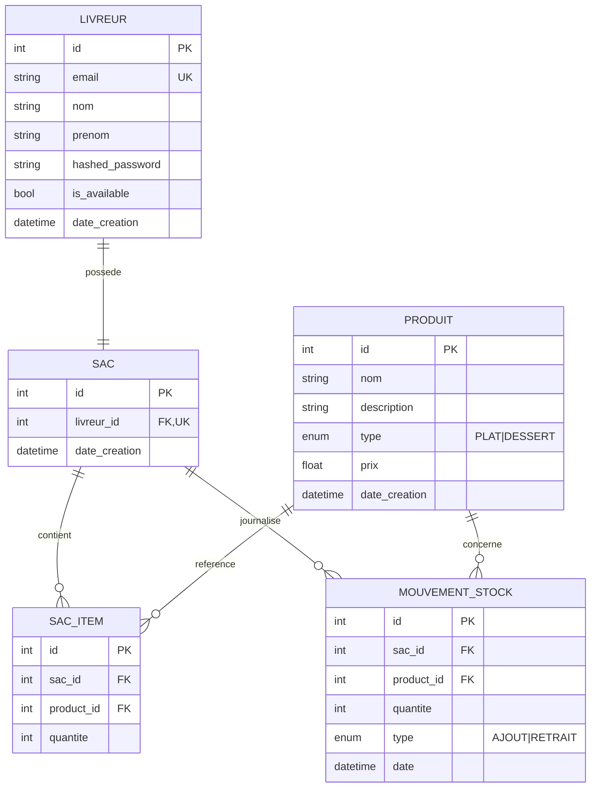

# Modèle Conceptuel de Données — CityLunch

## Diagramme entité-relation

## Cardinalités

| Relation                       | Cardinalité | Contrainte                                 |
|--------------------------------|:-----------:|--------------------------------------------|
| Livreur — Sac                  | 1 — 1       | unicité de `sac.livreur_id`                |
| Sac — SacItem                  | 1 — 0..n    | UNIQUE (sac, produit) sur SacItem          |
| Sac — MouvementStock           | 1 — 0..n    | append-only (audit)                        |
| Produit — SacItem              | 1 — 0..n    |                                            |
| Produit — MouvementStock       | 1 — 0..n    |                                            |